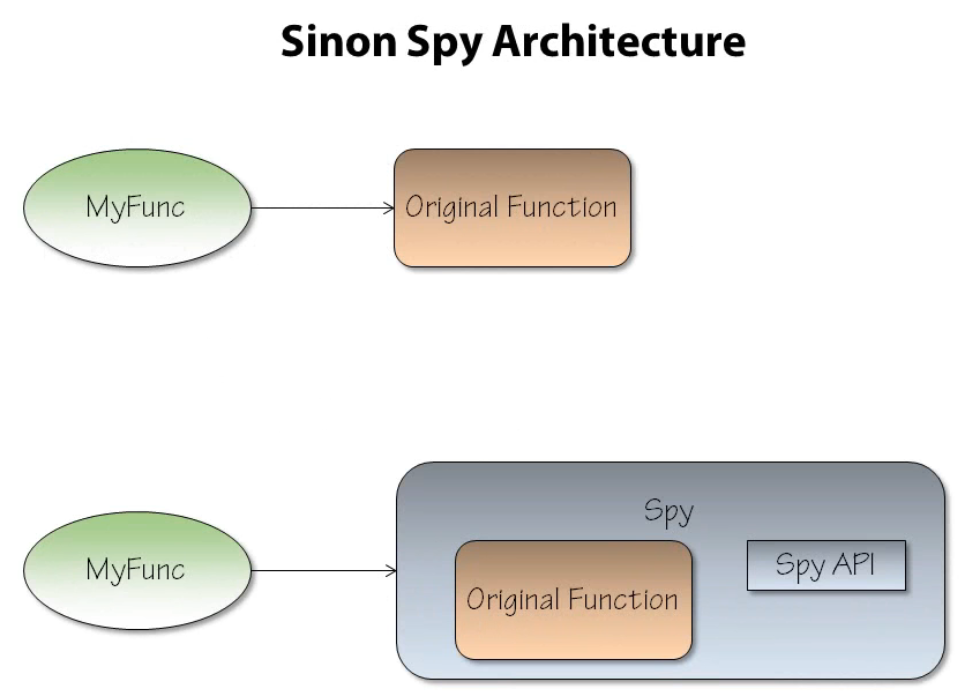
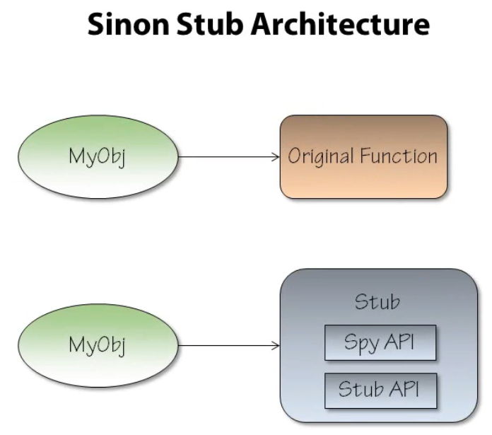
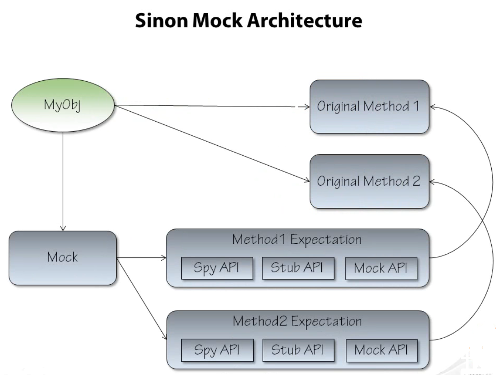

SinonJS
=======

**Disclaimer**: these are my personal notes from the pluralsight course, all content and images originate from there

* Mocking framework for JS
* Can mock **timers** (just as Jasmine) and **ajax requests**, feels very boilerplate :(
* **Sandboxing**: Prevent pollution of the runtime objects, truly isolate tests (remember problems with iboodspy), but it's still possible to make mistakes (sinon.text should prevent this, but couldn't get it to work.)

Spies
-----

* Note that **Jasmine** also supports spies out of the box!
* Provide a **test double** for a function or object method
* **Watch** existing functions (was it called?)
* **sinon.spy**
* limited value of calling through: **implicit dependencies** (i.e, don't use spies to call through to existing methods, this leads to test brittleness)

Custom assertions
----------
* **sinon-specific** assertions result in **clearer messages** on failure
* **sinon.assert** is the entry-point for these assertions

Stubs
-----

* provide dummy pre-programmed behavior
* spies API + extra methods to control behavior
* you can stub all methods of an object (read: full-blown interface stubbing behavior in typed languages!!) using **sinon.stub(objectToStub)**. Downside: you need a reference to the object to stub

Mocks
-----

* Set up **expectations** beforehand, test fails when expectations are not met in the end
* Compared to stubs: mocks define expectations **before** the stimulus, stubs verify assertians after
* Again, you pass in the object you want to mock (sadface)

Matchers
--------
* Like Java's hamcrest matchers
* Supports **fuzzy matching** of arguments
* Supports custom matchers and match compositions (and/or)

Notes
-----
* There is some use of magical strings (method names)
* You need actual objects to mock (no interface concept), does this mean that the #GOOS top-down approach does not apply to javascript development?